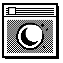
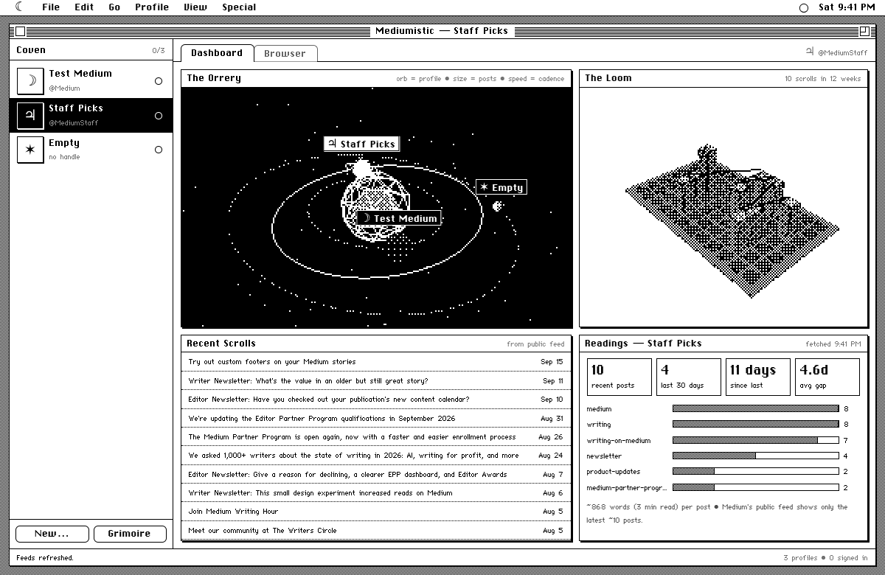
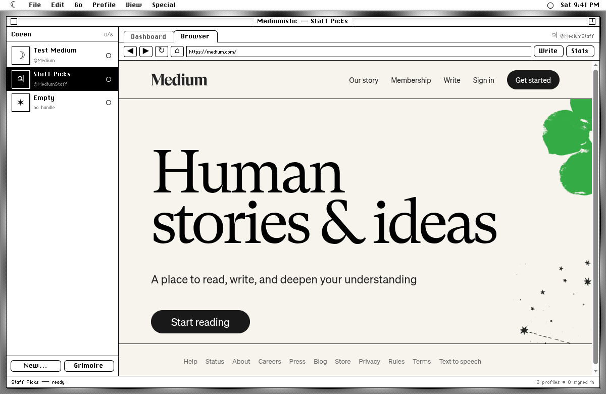
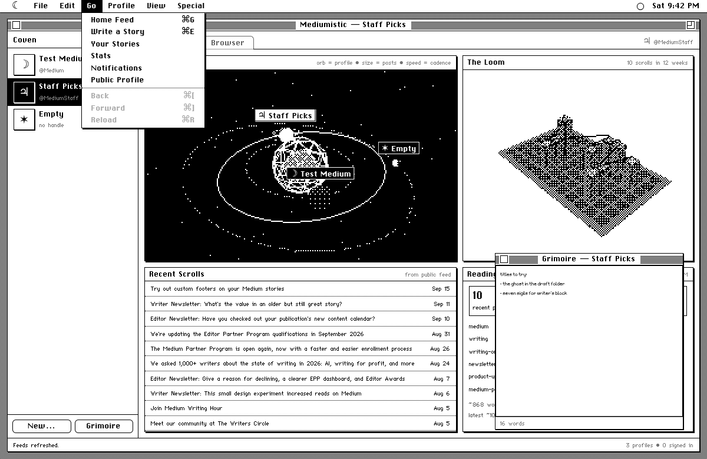
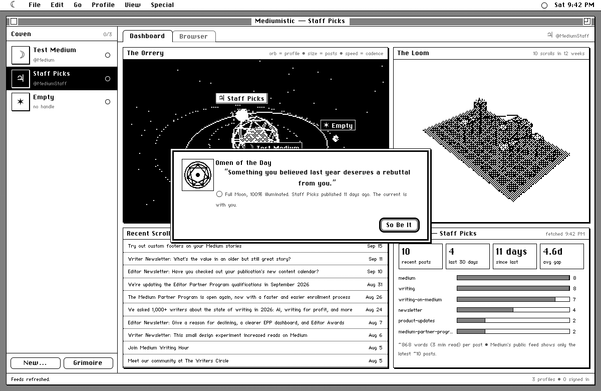
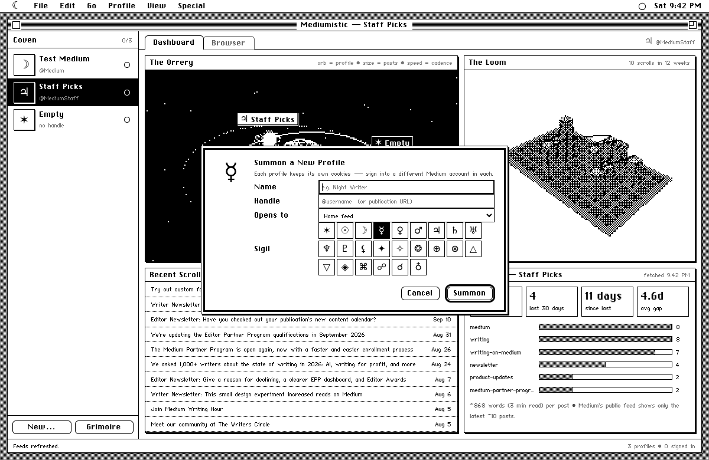

<p align="center">
  
</p>

<h1 align="center">Mediumistic</h1>

<p align="center">
  <i>a séance for your many selves</i><br>
  All your Medium accounts in one 1-bit Macintosh window.
</p>

<p align="center">
  
</p>

Mediumistic is a small desktop app for people who write on Medium under more than one account. Each profile lives in its **own sealed browser session**, so you can stay signed into all of them at once and switch with a keystroke. The whole thing is dressed as an original-era Macintosh: monochrome, Chicago font, striped title bars and pull-down menus. Each account's public data is rendered as **dithered three.js scenes**.

---

## Features

### Many accounts, one window
- **Isolated sessions.** Every profile gets its own persistent partition (`persist:medium-<id>`). Cookies, logins and cache never cross between accounts.
- **Sign-in popups stay in the right profile.** Google, Apple and X OAuth windows inherit the session of the profile that opened them.
- **Paste Sign-in Link (⌘L).** Medium's emailed magic link would sign in your system browser. Paste it here instead and only the current profile is signed in.
- **Signed-in indicator.** A filled dot next to each profile, read straight from its cookies.
- **⌘1–⌘9** switches profiles. Drag profiles in the sidebar to reorder them.
- Each profile has a sigil and can open to Home, New story, Stats, Your stories, Notifications or its public profile.

<p align="center">
  
</p>

### Dithered data visuals
Everything is rendered at low resolution, then collapsed to pure black and white with an 8×8 Bayer ordered-dither shader.

- **The Orrery.** Your accounts as a solar system. Each planet is a profile:
  - **size** is the number of recent posts
  - **orbital speed** is how many posts it made in the last 30 days
  - **moons** are its posts from the last 90 days

  Click a planet to select that profile, drag to orbit, scroll to zoom, and double-click to resume the drift.
- **The Loom.** The last 12 weeks of the selected profile's publishing as a woven 3D bar grid, threaded through each day you published.
- **Readings.** Recent post count, posts in the last 30 days, time since the last post, average gap between posts, words per post and top tags.
- **Recent Scrolls.** The latest posts. Click one to open it inside that profile.

Stats come from each account's public RSS feed (`medium.com/feed/@handle`). They're cached to disk, so the dashboard still renders offline.

### Bells, whistles and omens
<p align="center">
  
  
</p>

- Startup chime and a *Welcome to Mediumistic* splash
- Synthesized clicks, beeps and menu blinks (Web Audio, no sample files)
- A menu bar with a live clock and the **current moon phase**
- **Omen of the Day:** a daily writing prompt with a generated sigil and a nudge based on your posting streak
- **Grimoire:** a notepad desk accessory for each profile, dragged by its outline like System 6 windows
- **Monochrome Pages:** optionally renders Medium itself in black and white
- Busy cursor while pages load, an inactive-window title bar, and a classic alert box when something bombs

<p align="center">
  
</p>

---

## Install (Linux)

You need `node`/`npm` and a system Electron. It was built against Arch's `electron43`.

```bash
sudo pacman -S electron43          # or your distro's electron package
git clone https://github.com/numbpill3d/mediumistic.git ~/mediumistic
cd ~/mediumistic
./install.sh
```

`install.sh`:
1. installs `three` and `@sakun/system.css`
2. copies the Chicago, Geneva and Monaco bitmap fonts out of system.css
3. installs icons into `~/.local/share/icons/hicolor`
4. adds **Mediumistic** to your app menu

To run it without installing:

```bash
npm install && ./install.sh   # fonts are needed either way
npm start
```

## Keyboard

The ⌘ shown in the menus means **Ctrl** on Linux.

| Keys | Action | Keys | Action |
|---|---|---|---|
| ⌘N | New profile | ⌘D / ⌘B | Dashboard / Browser |
| ⌘I | Edit profile | ⌘G | Home feed |
| ⌘L | Paste sign-in link | ⌘E | Write a story |
| ⌘1–⌘9 | Switch profile | ⌘[ / ⌘] | Back / Forward |
| ⌘K | Grimoire | ⌘R | Reload |
| ⌘Q | Quit | | |

Inside a Medium page, **Ctrl+B / I / K / E are left to Medium's editor** (bold, italic, link…). All the other shortcuts above still reach the app.

## Signing in

1. Create a profile (**File ▸ New Profile…**) with a name and your `@handle`.
2. It opens in the **Browser** tab. Click *Sign in* on Medium.
3. **Email:** Medium mails you a link. Don't click it. Copy it and use **File ▸ Paste Sign-in Link…**
4. **Google, Apple or X:** the popup opens inside the same profile. Some providers may still refuse embedded browsers; if so, use the email link.
5. Repeat for your next account.

**Special ▸ Sign Out & Forget** wipes one profile's cookies and cache. **Profile ▸ Banish** removes the profile entirely. Neither touches your Medium account.

## How it's built

```
main.js        Electron main process: partitions, popup→session binding, UA cleanup,
               RSS fetch + cache, shortcut forwarding from webviews
preload.js     tiny contextBridge API (window.mx)
src/app.js     menus, dialogs, profiles, <webview>s, dashboard, sounds, omens
src/viz.js     DitherStage (render target → Bayer 1-bit pass), Orrery, Loom, sigils
src/style.css  System 6 chrome
src/vendor/    three.js (vendored ES module)
```

- Uses `<webview>` rather than `WebContentsView`, so the DOM menus and dialogs draw *over* the page.
- Webviews are sandboxed, have no node integration, and only `https` Medium partitions may attach.
- The `Electron/x` token is stripped from the user agent so sign-in isn't refused.
- The three.js loop pauses when the dashboard is hidden or the window loses focus, which keeps the iGPU free for the pages.
- Data lives in `~/.config/Mediumistic/`: `mediumistic.json`, `feeds/`, and `Partitions/medium-*`.

## Limitations

- Medium's public feed only exposes the **latest ~10 posts**, so the visuals show recent activity, not lifetime stats. Private stats (views, reads, earnings) stay on Medium's Stats page. **Go ▸ Stats** opens it inside the profile.
- Linux-first. It should run on macOS and Windows with a matching Electron, but that hasn't been tested.

## Credits

- Bitmap fonts (ChiKareGo2, FindersKeepers, Monaco) come via [system.css](https://github.com/sakofchit/system.css). They're not redistributed here; `install.sh` fetches them from npm.
- [three.js](https://threejs.org) (MIT)
- Not affiliated with Medium.

MIT © 2026 scorn
